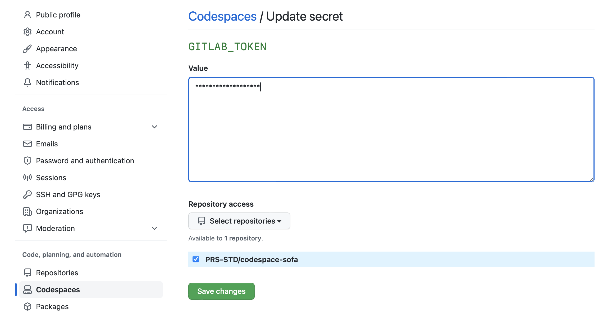

# SOFA bridge codespace
This is a codespace template to speed up the connection to [SOFA](https://gitlab.sofa.dev)! 

## Pre-requisites
Before using this codespace you should have:
- A personal access token to your GITLAB account with scope `write_repository`. You can create a personal access token in your gitlab account settings.
- A secret in your GitHub profile with the name GITLAB_TOKEN and the value of your personal access token. For this, go to your github profile settings, then `Codespaces > Codespaces secrets > New secret`. Please, make sure to give acceess to this repository (PRS-STD/codespace-sofa). 
- Another secret in your github profile with the name `ECB_EMAIL` with your ECB email address. This is used to set yout email address in GIT commits.
- Another secret with the name `ECB_NAME` with your full name. This is used to set your name in GIT commits. If this is not provided, the one in your github account will be used.

Mind that commits in git will appear with author: `your name` <`your ECB email address`>".

## Usage
Once the codespace is ready, it will ask you the location of your SOFA repository. You can use two different notations:
- Short notation: group/project_name (e.g. atlas/atlas_meeting_generator)
- URL notation: just the URL to your SOFA repository (e.g. https://gitlab.sofa.dev/atlas/atlas_meeting_generator.git)

After providing this information, your repository will be cloned in your codespace. For your codespace to use the container configuration in your SOFA repository, you will need to rebuild the container. You can do this in VS Code using the command *Rebuild container*: `CTRL+SHIFT+P -> Codespaces: Rebuild Container`.

After this, you are ready to go! One more hint: it is convenient to give a name to your codespace. You can do this in VS Code using the command *Rename codespace*: `CTRL+SHIFT+P -> Codespaces: Rename Codespace`. Also, you can do it in [GitHub codespaces](https://github.com/codespaces). 

## Troubleshooting
*TODO*